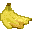
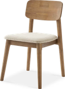
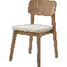
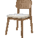
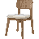
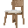

# img2pixelart

图片转像素画 CLI。

## 安装

```bash
pip install img2pixelart
```

或从源码安装：

```bash
uv sync
```

## 效果

| 原图 | 96px | 64px | 48px | 32px |
|---|---|---|---|---|
|  |  |  |  |  |
|  |  |  |  |  |

## 用法

### 图形界面

```bash
img2pixelart-ui
```

打开图片后，可调整完整的感知、结构和渲染参数，加载 `.txt` 调色板，
自动刷新预览并将结果保存为 PNG。

### 单张转换

```bash
img2pixelart img=docs/assets/banana_orig.png width=96 height=96
```

输出在当前目录的 `result.png`。

指定调色板后，各色相族的明度 ramp 会先匹配到调色板最近色；抖动、阴影和轮廓
都沿匹配后的 ramp 渲染，因此所有非透明像素都来自调色板：

```bash
img2pixelart img=docs/assets/banana_orig.png palette=palette/resurrect-64.txt width=96 height=96
```

### 图片转 ASCII 字符画

```bash
img2pixelart ascii img=docs/assets/banana_orig.png ascii.rows=60
# → outputs/single/<ts>/result_ascii.txt
```

输出行数由 `ascii.rows` 控制，列数按图片宽高比自动推导（字符栅格按 8×16
半角等宽比例）。流程与像素画共享边缘算法：线条画走 Otsu 二值化 +
Zhang-Suen 细化，照片走双边滤波 Canny 后细化；每个字符格用 Sobel 梯度
方向选择横 / 竖 / 斜字符，边缘密度决定线宽。带 alpha 通道的源图用 alpha
做主体遮罩（替代 SAM 分割），透明背景自动置空。

### 裁边

去掉图片四周空白区域：

```bash
img2pixelart crop-padding docs/assets/banana_orig.png
# → docs/assets/banana_no_padding.png
```

### 参数扫网（multirun）

多个参数值用逗号分隔，`-m` 开启 multirun，结果自动拼成 `combined.png`：

```bash
# 渐变层次 × 抖动风格 × 描边，81 种组合
img2pixelart -m \
  img=docs/assets/banana_orig.png \
  perceive.ramp_steps=5,7,9 \
  render.silhouette_darkness=0,0.5,1 \
  render.internal_darkness=0,0.5,1 \
  render.dither_style=ordered,diagonal,clustered \
  width=96 height=96
```

### 并行扫网

加 Joblib launcher，`n_jobs=-1` 用满所有 CPU：

```bash
img2pixelart -m \
  img=docs/assets/banana_orig.png \
  perceive.ramp_steps=5,7,9 \
  render.silhouette_darkness=0,0.5,1 \
  render.internal_darkness=0,0.5,1 \
  render.dither_style=ordered,diagonal,clustered \
  width=96 height=96 \
  hydra/launcher=joblib \
  hydra.launcher.n_jobs=-1
```

### 调试输出

默认只写 `result.png`；加 `debug=true` 后，perceive / structure / render / ascii 各阶段的中间
PNG（`01_original` … `22_palette_strip` 及 ascii 调试图）会写入输出目录：

```bash
img2pixelart img=docs/assets/banana_orig.png width=96 height=96 debug=true
img2pixelart ascii img=docs/assets/banana_orig.png ascii.rows=60 debug=true
```

GUI 预览默认不写调试产物，与 CLI 默认一致。

### 视觉 A/B 基线（行为敏感变更）

Issue [#1](https://github.com/asinkLuno/img2pixelart/issues/1) 的基准由受版本控制的
`tools/visual_regression.py` 固化。它覆盖 `tests/cup.png`、
`tests/cup_no_padding.png`、`docs/assets/banana_orig.png` 与
`docs/assets/chair_orig.png`，像素画在 `48 / 64 / 96` 方格运行，ASCII 同时覆盖
`rows=40 / 60`。生成物仅落在（并被 Git 忽略的）
`outputs/ab/<topic>/<UTC timestamp>/`。

```bash
# 当前实现的完整像素画 + ASCII 基线矩阵
uv run python tools/visual_regression.py baseline

# 每个命令生成 A/B 的 result.png、调试 palette、comparison.png 和 metrics.json
uv run python tools/visual_regression.py ab-2  # bilateral → mean-shift vs mean-shift only
uv run python tools/visual_regression.py ab-3  # fixed Canny vs ratio×Otsu Canny
```

AB-1（bayer vs pattern/ordered）已在 issue #1 中得出结论并完成合并（bayer 并入
`ordered`），实验随其归档，不再包含在 runner 中。其余实验的变体侧（非现状一侧）在
临时包副本中应用严格的实验补丁，不修改工作树；若目标实现移动，补丁会显式失败而不是
悄悄比较了错误的算法。
评审时打开 `comparison.png`，再读取 `metrics.json` 的逐像素差异比例、平均通道差异和
`05_palette` / `22_palette_strip` 一致性。数值用于定位差异，结论仍以 **B 相对 A 没有
可感知质量回退** 的人工评审为准；将 `AB-N: 结论 / 倾向 / 证据（输出路径或贴图）`
作为 issue 评论。ASCII 矩阵是基线覆盖，当前 AB 仅比较像素画流水线。

## 关键参数

| 参数 | 说明 | 默认值 |
|---|---|---|
| `width` | 输出宽度 | 64 |
| `height` | 输出高度 | 64 |
| `alpha_threshold` | alpha ≥ 此值视为前景（像素画与 ASCII 共用） | 128 |
| `perceive.ramp_steps` | 每色相的明度阶梯数 | 7 |
| `perceive.requested_groups` | 色相族数量 | 3 |
| `debug` | 调试输出开关：`true` 时各阶段中间 PNG 写入输出目录 | false |
| `render.dither_style` | 抖动风格：`none` / `ordered` / `diagonal` / `clustered` / `floyd_steinberg` | ordered |
| `render.silhouette_darkness` | 外轮廓暗化强度 0–1（0=无） | 1.0 |
| `render.internal_darkness` | 内部描边暗化强度 0–1（0=无） | 1.0 |
| `ascii.subject_coverage` | ASCII 字符格前景覆盖率阈值 | 0.5 |
| `ascii.denoise_strength` | ASCII 照片边缘去噪强度（1.0 为默认） | 1.0 |

完整参数见 `img2pixelart/conf/` 目录下各阶段 YAML 文件。

## 参数迁移表（v0.x → 当前）

| 旧参数 | 新参数 / 等效值 |
|---|---|
| `render.dither_method=bayer` | `render.dither_style=ordered` |
| `render.dither_method=pattern` | `render.dither_style=ordered`（原 pattern_style=ordered） |
| `render.pattern_style` | 并入 `render.dither_style`（ordered / diagonal / clustered） |
| `render.dither_fraction_min/max` | 固定为 `[0.18, 0.82]`（内部常量） |
| `render.dither_gradient_min` | 固定为 `0.8`（内部常量） |
| `render.silhouette_dark_step` + `silhouette_dark_scale` | `render.silhouette_darkness`（默认 1.0 = 原 step=0, scale=0.75） |
| `render.internal_outline_dark_steps` + `internal_outline_dark_scale` | `render.internal_darkness`（默认 1.0 = 原 steps=2, scale=0.6） |
| `perceive.alpha_threshold` / `ascii.alpha_threshold` | 顶层 `alpha_threshold` |
| `perceive.canny_low` / `perceive.canny_high` | Otsu 自适应（内部常量 `max(Otsu×0.33, 10)` / `Otsu`，与 ascii 策略一致） |
| `ascii.alpha_coverage` | `ascii.subject_coverage` |
| `ascii.bilateral_d` / `bilateral_sigma_color` / `bilateral_sigma_space` | `ascii.denoise_strength`（默认 1.0 = 原 9 / 75 / 75） |
