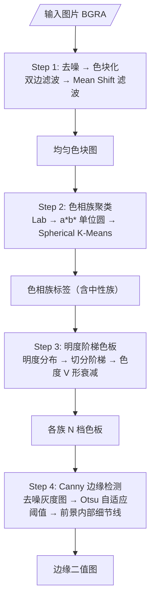

# 感知阶段（Perceive）

感知阶段是像素画生成流水线的第一步，负责将输入图片转换为"色相族 + 明度阶梯"的中间表示。所有颜色运算在 CIELAB 色彩空间完成，理论基础见 [色相环.md](%E8%89%B2%E7%9B%B8%E7%8E%AF.md)。

______________________________________________________________________

## 概览



______________________________________________________________________

## Step 1: 去噪 → 色块化

输入图片先经**双边滤波（Bilateral Filter）**去噪，再经**Mean Shift 滤波**将相似颜色区域合并为均匀色块。

```python
denoised = cv2.bilateralFilter(bgr, d=9, sigmaColor=75, sigmaSpace=75)
blocks = cv2.pyrMeanShiftFiltering(denoised, sp=15, sr=40)
```

| 输入原图 | 双边滤波后 | Mean Shift 色块化 |
|----------|-----------|-------------------|
|  |  |  |

双边滤波在去噪的同时保留边缘；Mean Shift 将颜色相近的相邻像素合并为同一色块，消除纹理和渐变。

### 参数影响

**`mean_shift_sp`（空间带宽）**——控制色块大小：

| sp=5 | sp=15（默认） | sp=30 |
|------|-------------|-------|
|  |  |  |
| 小块，保留更多细节 | 中等块 | 大块，强简化 |

- 值越大 → 色块越大、越少，画面越简化
- 值太小 → 保留过多纹理噪声，后续聚类不稳定
- 值太大 → 丢失形状信息

**`denoise_sigma`（颜色 Sigma）**——双边滤波的颜色敏感度：

- 值越大 → 保留的细节/纹理越多（滤波越弱）
- 值越小 → 图像越平滑（滤波越强）

**`mean_shift_sr`（颜色带宽）**——Mean Shift 的颜色合并阈值：

- 值越大 → 更多不同颜色被合并，色块越少

______________________________________________________________________

## Step 2: 色相族聚类

将色块化后的前景像素投影到 CIELAB 的 a\*b\* 平面（见 [色相环.md](%E8%89%B2%E7%9B%B8%E7%8E%AF.md)），使用 **Spherical K-Means** 在单位圆上聚类。

```
Lab 像素 → a*b* 坐标 → 归一化到单位圆 → Spherical K-Means → 色相族
                                                              │
                                              低色度像素 ────→ 中性族
```

每个颜色代表一个色相族。下图为 **requested_groups=2** 时的结果（香蕉图产生 2 个彩色族 + 1 个中性族）：


> 红色 = 族 0（黄色系），蓝色 = 族 1（暗色系），灰色 = 中性族（低色度像素）

### 参数影响

**`requested_groups`**——期望的彩色族数量。实际数量可能因近邻色相簇合并而减少：

| groups=1 | groups=2（默认） | groups=3 | groups=4 |
|----------|----------------|----------|----------|
|  |  |  |  |
| 1 族（全彩色归一） | 2 族 | 3 族 | 4 族（细分） |

- 值越大 → 色相划分越细，颜色过渡越丰富，但每个族的像素变少
- 值越小 → 颜色越概括，风格更统一
- 简单图片（如香蕉）用 2 族即可，复杂图片（多人像）可能需要更多

> 不同 `requested_groups` 的最终效果对比见本文末尾的 [综合对比](#%E7%BB%BC%E5%90%88%E5%AF%B9%E6%AF%94)。

**`chroma_floor`**——色度下限。a\*b\* 距离 < 此值的像素归入中性族，只靠明度区分：

- 值越大 → 更多颜色被视为"灰色"，归入中性族
- 值越小 → 更多颜色被保留在彩色族中
- 极低值（如 2.0）→ 几乎只有真正的灰色才入中性族

聚类使用固定的近邻合并阈值，忽略过暗像素；有效像素过少时退化为中性族，过多时以固定随机种子抽样。它们是保证稳定性和性能的实现规则，不是风格参数。

______________________________________________________________________

## Step 3: 明度阶梯色板

对每个色相族（含中性族），统计前景像素的明度分布，构建 N 档明度阶梯色板。

### 明度范围

取该族像素明度分布的固定 4% 到 96% 分位，均匀切分为 N 档。并保证跨度至少为 `ramp_minimum_span`（默认 42.0 L 单位）。

### 色度 V 形衰减

每档颜色 = 族色相方向 × 代表色度 × 色度衰减系数。衰减系数沿阶梯呈 **V 形**——两端低、中间高：

```
chroma_scale[i] = 1.0 - (1.0 - 0.78) × |position[i]|
```

物理直觉：暗部灰度化（阴影下色彩饱和度降低），亮部泛白化（高光洗白颜色）。


*默认色板（2 族 × 5 档 = 10 色）。上排 = 族 0，下排 = 中性族。*

### 参数影响

**`ramp_steps`**——每个族的明度阶梯数。总色板大小 ≈ 族数 × steps：

| steps=3 | steps=5（默认） | steps=7 | steps=9 |
|---------|--------------|---------|---------|
|  |  |  |  |

- 值越大 → 明度过渡越细腻，但总颜色数增多
- 值越小 → 色阶越明显（更"像素画"），但过渡可能生硬

阶梯端点固定保留 0.78 倍色度，代表色度固定取中位数，并有固定上限以避免极端鲜艳。明度分位、色度衰减和上限均为实现规则；`ramp_minimum_span` 仍可控制最小明度跨度。

______________________________________________________________________

## Step 4: Canny 边缘检测

在去噪后的灰度图上运行 Canny 边缘检测，与前景侵蚀掩码取交集，得到只位于前景内部的细节线：


这些细节线在结构阶段降采样后，用于推导内部轮廓（internal detail）。

### 阈值策略

Canny 双阈值采用 **Otsu 自适应**（与 ascii 照片边缘策略一致，结论见 issue #1 的 AB-3）：

```python
otsu, _ = cv2.threshold(gray, 0, 255, cv2.THRESH_BINARY + cv2.THRESH_OTSU)
canny = cv2.Canny(gray, max(otsu * 0.33, 10.0), otsu)
```

- 低阈值 = `max(Otsu × 0.33, 10)`，高阈值 = Otsu；
- 阈值随图像对比度自动调整：低对比度图用低阈值、高对比度图用高阈值，避免固定阈值丢失弱边缘或引入噪声；
- 阈值与比例均为内部常量，不再是可调参数。

> 全分辨率 tier（明度分档）不再在感知阶段计算：`assign_lightness_tiers` 与对应的 `07_reconstructed` 调试图已删除。结构阶段基于降采样明度图 `L_down` 自行重算 `tier_down`，见[结构阶段](%E7%BB%93%E6%9E%84%E9%98%B6%E6%AE%B5.md)。

______________________________________________________________________

## 感知阶段输出

感知阶段的返回 dict 只保留下游消费的键：

| 键 | 说明 |
| --- | --- |
| `L` | 色块化后的明度图（float32 Lab L 通道） |
| `family_labels` | 色相族标签（含中性族），背景为 -1 |
| `hue_directions_ab` | 各族单位色相方向 |
| `ramps_bgr` / `ramp_l` | 各族明度阶梯色板（BGR / Lab L） |
| `steps_per_family` | 各族阶梯数 |
| `foreground` / `alpha_full` | 前景掩码与原始 alpha 通道 |
| `canny` | 前景内部 Canny 细节线 |

调试用中间量（原图、去噪、色块、全分辨率 tier）只在函数内部使用即弃，不进入返回 dict；
调试图编号为连续的 `01_original` … `06_canny`。

______________________________________________________________________

## 综合对比

各 `requested_groups` 对应的色板和最终输出（width=96, height=96，其他默认）：

| groups=1 | groups=2（默认） | groups=3 | groups=4 |
|----------|----------------|----------|----------|
|  |  |  |  |

> g1：所有彩色合并为一个族，色板最小（1 彩色族 + 中性族 = 2 族 × 5 档 = 10 色）
> g4：色相细分，4 个彩色族 + 中性族 = 5 族 × 5 档 = 25 色，过渡更丰富

______________________________________________________________________

## 参数速查表

| 参数 | 默认值 | 影响 |
|------|--------|------|
| `denoise_d` | 9 | 双边滤波核直径，奇数 |
| `denoise_sigma` | 75 | 双边滤波颜色敏感度。↑ 保留更多细节 |
| `mean_shift_sp` | 15 | 色块空间带宽。↑ 色块越大 |
| `mean_shift_sr` | 40 | 色块颜色带宽。↑ 色块越少 |
| `requested_groups` | 2 | 期望彩色族数。↑ 颜色划分越细 |
| `chroma_floor` | 5.0 | 中性色度阈值。↑ 更多色归入中性族 |
| `ramp_steps` | 5 | 每族明度阶梯数。↑ 过渡越细腻 |
| `ramp_minimum_span` | 42.0 | 明度阶梯最小跨度 |
| `alpha_threshold`（顶层） | 128 | Alpha 前景判定阈值（像素画与 ASCII 共用） |

Canny 双阈值改为 Otsu 自适应（`max(Otsu×0.33, 10)` / `Otsu`），`canny_low` / `canny_high` 已删除。
