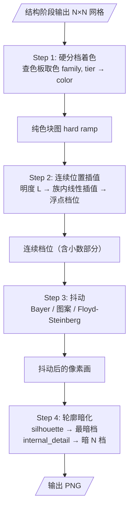
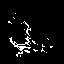
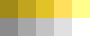

# 渲染阶段（Render）

渲染阶段将结构阶段的网格化信息转换为最终像素画输出。核心任务：按色相族+明度档取色 → 抖动产生伪半色调过渡 → 轮廓暗化增强立体感。

______________________________________________________________________

## 概览



______________________________________________________________________

## Step 1: 硬分档着色

每个前景网格按 `(色相族, 明度档位)` 从感知阶段的色板中取对应颜色：

```
color = ramps_bgr[family, tier]
```

得到一张无锯齿、无过渡的纯色块图：


*硬分档着色（width=96, height=96）。每个像素精确取自色板的某一档，无任何过渡。*

注意这张图的局限：颜色过渡生硬（因为只有 N 档明度），没有立体感。

______________________________________________________________________

## Step 2: 连续位置插值

把每像素的明度 L\* 线性映射到其色相族阶梯内的**连续位置**（浮点数，0 到 steps-1）：

```python
position = interp(L_pixel, ramp_L[family], [0, 1, ..., steps - 1])
```

- `floor(position)` → 当前档（低档）
- `ceil(position)` → 下一档（高档）
- `position - floor(position)` → 小数部分（两档之间的"距离"）

小数部分 > 0 意味着这个像素的颜色介于两档之间，需要用抖动来近似。

______________________________________________________________________

## Step 3: 抖动

抖动（dithering）在有明度渐变的区域用二值图案模拟中间色调。只在**满足全部条件**的像素上应用：

1. **非轮廓、非色阶边界** — 结构线必须保留清晰
1. **小数部分 ∈ [dither_fraction_min, dither_fraction_max]** — 太接近某一档不需抖动
1. **局部明度梯度 ≥ dither_gradient_min** — 平缓区域不需抖动

### 抖动掩码

白色 = 参与抖动的像素：


*抖动掩码（pattern 方法，width=96, height=96）。只有渐变区域的像素参与抖动。*

### 四种抖动方法

| 方法 | 原理 | 特点 |
|------|------|------|
| **none** | 不抖动，直接四舍五入 | 纯色块，色阶明显 |
| **bayer** | 4×4 Bayer 有序阈值矩阵 | 规则纹理，经典像素画风格 |
| **pattern** | 4×4 图案字典（17 级覆盖率） | 图案可定制，比 Bayer 更灵活 |
| **floyd_steinberg** | 误差扩散到相邻同族像素 | 无规则纹理，过渡最自然 |

**none（无抖动，纯色块）：**


**bayer（有序抖动）：**


**pattern（微图案抖动，默认）：**


**floyd_steinberg（误差扩散）：**


> Floyd-Steinberg 的误差**只在同色相族内传播**，避免跨族混色产生脏色。

### 参数影响

**`dither_method`**——抖动方法选择：

| none | bayer | floyd_steinberg | pattern（默认） |
|------|------|-----------------|----------------|
|  |  |  |  |

- none：最"纯"的像素画，色阶清晰可见
- bayer：经典有序抖动，规则纹理
- floyd_steinberg：最自然的过渡，接近照片风格
- pattern：与 bayer 类似，但图案可定制

**`pattern_style`**（仅 `dither_method=pattern` 时生效）——图案的像素排列方式：

| ordered（默认） | diagonal | clustered |
|----------------|----------|-----------|
|  |  |  |

- ordered：Bayer 矩阵顺序，均匀分散
- diagonal：对角线扫描，斜向纹理
- clustered：中心向外扩散，产生网点效果

**`dither_fraction_min` / `dither_fraction_max`**——抖动的小数部分区间：

| 区间 [0.0, 1.0] | [0.18, 0.82]（默认） | [0.4, 0.6] |
|-----------------|---------------------|-----------|
|  |  |  |

- 区间越宽 → 抖动覆盖越多区域，过渡越平滑，但可能引入不必要的纹理
- 区间越窄 → 只对"恰好卡在两档中间"的像素抖动，风格更干净
- 默认 [0.18, 0.82]：排除两端（已在某档附近的不需要抖动）

**`dither_gradient_min`**——局部明度梯度下限：

| grad ≥ 0.0（全区域） | grad ≥ 0.8（默认） | grad ≥ 2.0 | grad ≥ 5.0 |
|----------------------|-------------------|-----------|-----------|
|  |  |  |  |

- 低值（0.0）：所有区域都参与抖动，平滑区域也可能出现不必要纹理
- 高值（5.0）：只在剧烈明暗变化的边缘附近抖动，大面积区域保持纯色
- 默认 0.8：排除平缓区域，抖动只发生在有明显渐变处

______________________________________________________________________

## Step 4: 轮廓暗化

### 外轮廓（Silhouette）

精灵的外轮廓强制设为该色相族的最暗档：

```
final[y,x] = ramps[family[y,x], silhouette_dark_step] * silhouette_dark_scale
```

**`silhouette_dark_step`**——轮廓像素使用的明度档位：

| step=0（最暗，默认） | step=1 | step=2 | step=3 |
|---------------------|--------|--------|--------|
|  |  |  |  |

- 0：轮廓用该族最暗档，最强烈的轮廓对比
- 值越大 → 轮廓越浅，对比越弱。极端情况轮廓可能消失

**`silhouette_dark_scale`**——在选定色阶后进一步压暗外轮廓，默认 0.75；
0 为纯黑，1 保持色阶原色。

### 内部细节线（Internal Detail）

内部细节线设为比该像素当前档位暗 `internal_outline_dark_steps` 档：

```
final[y,x] = ramps[family[y,x], current_tier - internal_outline_dark_steps] * internal_outline_dark_scale
```

**`internal_outline_dark_steps`**：

| 暗 0 档（无暗化） | 暗 1 档（默认） | 暗 2 档 | 暗 4 档 |
|------------------|---------------|--------|--------|
|  |  |  |  |

- 0：内部细节线不暗化，与周围颜色相同（线不可见）
- 1–2：适中的细节强调
- 4+：内部线非常深，强调效果强

**`internal_outline_dark_scale`**——在选定色阶后进一步压暗内部线，默认 0.6；
0 为纯黑，1 保持色阶原色。

______________________________________________________________________

## 最终输出


*最终输出（pattern 抖动，width=96, height=96）*

最终色板（各族阶梯拼成的条带）：


*渲染使用的色板条带。每行 = 一个色相族，每列 = 一个明度档。*

______________________________________________________________________

## 抖动原理

### Bayer 有序抖动

```
4×4 Bayer 阈值矩阵（归一化到 [0,1)）：
┌               ┐
│ 0/16  8/16  ... │
│12/16  4/16  ... │
│   ...           │
└               ┘
```

每个像素比较 `fraction < threshold[row%4][col%4]` → 选高档，否则选低档。

### 微图案抖动（Pattern）

17 个预计算的 4×4 二值图案，覆盖 0/16 到 16/16 的覆盖率。小数部分量化到 0..16 的级别，查表决定每个 4×4 块内的明暗分布。

三种图案风格的区别在于像素填充顺序：

```
ordered (Bayer):    diagonal:           clustered:
· 1 · ·            · 1 · ·            · · · ·
· · · ·            · · 2 ·            · 1 2 ·
· · · ·            · · · 3            · 3 4 ·
· · · ·            · · · ·            · · · ·
```

### Floyd-Steinberg 误差扩散

逐行扫描，量化为最近整数档位后，误差按权重扩散到邻居：

```
     ×     7/16
3/16  5/16  1/16
```

关键约束：**误差只扩散到同色相族的像素**。这避免了红色族的误差扩散到蓝色族像素上产生紫色混色。

在扫描过程中，每个像素的连续明度值从初始值变为「初始值 + 邻居传来的累积误差」，再做取舍，本算法用内联 for 循环实现以确保同族约束。

______________________________________________________________________

## 参数速查表

| 参数 | 默认值 | 影响 |
|------|--------|------|
| `dither_method` | pattern | 抖动方法：none / bayer / floyd_steinberg / pattern |
| `pattern_style` | ordered | 图案风格（仅 pattern 模式）：ordered / diagonal / clustered |
| `dither_fraction_min` | 0.18 | 抖动小数下限。↑ 区间收窄 |
| `dither_fraction_max` | 0.82 | 抖动小数上限。↓ 区间收窄 |
| `dither_gradient_min` | 0.8 | 梯度阈值。↑ 只在更陡的区域抖动 |
| `silhouette_dark_step` | 0 | 轮廓暗化档位。↑ 轮廓越浅 |
| `silhouette_dark_scale` | 0.75 | 轮廓亮度缩放。↓ 轮廓越深 |
| `internal_outline_dark_steps` | 2 | 内部线暗化档数。↑ 细节越深 |
| `internal_outline_dark_scale` | 0.6 | 内部线亮度缩放。↓ 内部线越深 |
