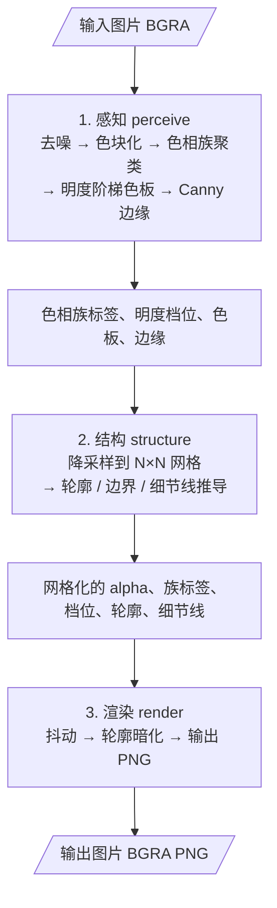

# 像素画生成算法

流水线分为三个阶段：**感知（perceive）** → **结构（structure）** → **渲染（render）**。

## 总览

______________________________________________________________________

## 一、感知阶段（perceive）

> **详细文档**：[感知阶段.md](%E6%84%9F%E7%9F%A5%E9%98%B6%E6%AE%B5.md) — 含每一步的图解、参数效果对比、完整参数速查表。
>
> **理论基础**：[色相环.md](%E8%89%B2%E7%9B%B8%E7%8E%AF.md) — CIELAB 色彩空间、色度、色相角、Spherical K-Means。

感知阶段负责将输入图片转换为"色相族 + 明度阶梯"的中间表示：

1. **去噪 → 色块化**：双边滤波去噪，Mean Shift 将相似颜色合并为均匀色块
1. **色相族聚类**：在 a\*b\* 单位圆上用 Spherical K-Means 聚类，低色度像素归入中性族
1. **明度阶梯色板**：每族按明度分布切分 N 档，色度沿阶梯 V 形衰减（暗部灰度化、亮部泛白化）
1. **明度分档**：每像素就近分配到其族的明度档位
1. **Canny 边缘**：检出前景内部细节线

______________________________________________________________________

## 二、结构阶段（structure）

> **详细文档**：[结构阶段.md](%E7%BB%93%E6%9E%84%E9%98%B6%E6%AE%B5.md) — 含每一步的图解、参数效果对比、完整参数速查表。

结构阶段将全分辨率信息降采样到 N×N 像素画网格，并推导轮廓与内部细节：

1. **降采样**：Alpha（面积平均+阈值）、色相族/明度档位（多数投票）、明度（族加权均值）、Canny（面积平均+阈值）
1. **结构线推导**：轮廓（silhouette）、色相族边界、色阶边界、内部细节线（Canny + Zhang-Suen 细化）
1. **小尺寸清理**（size ≤ 64）：闭孔、去碎块、多数平滑、Canny 抑制

______________________________________________________________________

## 三、渲染阶段（render）

> **详细文档**：[渲染阶段.md](%E6%B8%B2%E6%9F%93%E9%98%B6%E6%AE%B5.md) — 含四种抖动方法对比、图案风格对比、参数效果图解、完整参数速查表。

渲染阶段将网格化信息转换为最终像素画输出：

1. **硬分档着色**：按 (色相族, 明度档) 从色板取色
1. **连续位置插值**：明度 → 族内线性插值 → 浮点档位
1. **抖动**：小数部分在梯度区域用 Bayer / 图案 / Floyd-Steinberg 产生伪半色调过渡，误差只在同族内传播
1. **轮廓暗化**：silhouette → 最暗档，internal detail → 暗 N 档
