# 结构阶段（Structure）

结构阶段将感知阶段的全分辨率信息降采样到 N×N 的像素画网格，并推导轮廓、边界、内部细节线。

______________________________________________________________________

## 概览

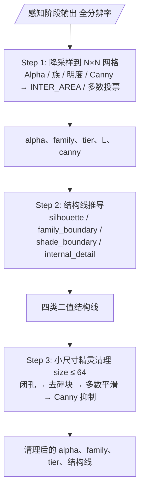

______________________________________________________________________

## Step 1: 降采样到目标网格

全分辨率的感知信息缩放到 `size × size`（由 CLI `--size` 控制）。不同信息采用不同的降采样策略：

### Alpha 掩码

INTER_AREA（面积平均）缩放后，覆盖率 ≥ `alpha_coverage` 的网格判为前景：


*size=96 时的 alpha 掩码*

### 色相族 / 明度档位标签

**多数投票（majority voting）**：每个目标网格统计原区域内有效的标签，取出现次数最多的：

```python
# 对每个 N×N 网格，取原区域内出现最多的 family label
family_down[i,j] = mode(family_labels[y0:y1, x0:x1])
```

这样保证一个网格只属于一个色相族——像素画的每个"像素"只有一个颜色。

### 明度图

**族加权面积平均**（`_down_family_weighted_L`）：只统计该网格获胜 family 的前景像素明度均值。没有该族像素的网格 fallback 到全格均值。

这比直接面积平均更精确——避免了同一网格内不同族像素的明度互相污染。

### Canny 边缘

INTER_AREA 面积平均后，覆盖率 ≥ `edge_coverage` 的网格判为边缘：

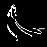
*降采样后的 Canny 边缘（size=96）*

______________________________________________________________________

## Step 2: 结构线推导

在降采样网格上推导四类二值结构线：

### 轮廓（Silhouette）

Alpha 掩码的**内侧边界**——腐蚀后消失的那一圈像素，即精灵的外轮廓：

```
silhouette = alpha & ~erode(alpha)
```


### 色相族边界（Family Boundary）

相邻网格属于**不同色相族**的边界：

```
family_boundary[i,j] = family[i,j] != family[neighbor]
```


### 色阶边界（Shade Boundary）

相邻网格属于**不同明度档位**的边界：

```
shade_boundary[i,j] = tier[i,j] != tier[neighbor]
```

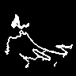

### 内部细节线（Internal Detail）

Canny 边缘中靠近轮廓或族边界的部分，经 **Zhang-Suen 细化**得到 1 像素宽的线：

```
candidate = canny_down & dilate(silhouette | family_boundary, radius)
internal_detail = thin(candidate & ~shade_boundary & ~silhouette)
```

为什么需要约束？直接降采样的 Canny 线可能出现在画面任何位置，但像素画中只有"有意义"的线才该保留——靠近轮廓的（物体边缘的纹理）或靠近族边界的（色相变化的轮廓）。远离这些结构的线多是噪声。

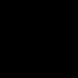

### 合并轮廓

最终轮廓 = silhouette ∪ internal_detail：

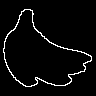
*合并轮廓（size=96）。白线在渲染阶段会被暗化为黑色。*

______________________________________________________________________

## Step 3: 小尺寸精灵清理（`size ≤ 64`）

当网格很小时，面积平均会留下大量杂点、破碎区域和不稳定的明度过渡。此步骤在 `size ≤ small_cleanup_threshold`（默认 64）时自动触发：

1. **闭孔**（`small_hole_close`）：填充 alpha 掩码中的小洞
1. **去碎块**：删除面积 < 总面积 0.1% 的孤立连通分量
1. **平滑 family**：3×3 多数投票，只保护轮廓像素
1. **平滑 tier**：3×3 多数投票，保护轮廓 + 族边界像素
1. **Canny 抑制**：`size ≤ small_skip_canny_under`（默认 40）时关闭 Canny 细节线

### 参数影响

**`small_cleanup_threshold`**——触发清理的尺寸上限。设为 0 则永不触发：

| threshold=0（关闭） | threshold=32 | threshold=64（默认） | threshold=128（始终） |
|---------------------|-------------|---------------------|----------------------|
| 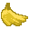 |  |  |  |

> size=32 时的对比。threshold=0 不清理（杂点多），threshold=128 总是清理（更干净）。

**`small_cleanup_passes`**——局部多数平滑迭代次数：

| passes=0 | passes=1 | passes=2（默认） | passes=4 |
|----------|----------|----------------|----------|
|  | 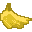 |  | 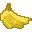 |

> size=32 时的对比。passes 越多 → 画面越平滑，但过度平滑会导致细节丢失。

______________________________________________________________________

## 输出尺寸对比

size 是最核心的结构阶段参数，它直接决定输出像素画的精细度：

| size=32 | size=48 | size=64 | size=96 |
|---------|---------|---------|---------|
|  |  |  |  |

对应的 alpha 掩码：

| size=32 | size=48 | size=64 | size=96 |
|---------|---------|---------|---------|
| 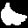 |  |  |  |

对应的轮廓线：

| size=32 | size=48 | size=64 | size=96 |
|---------|---------|---------|---------|
| 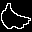 | 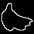 |  |  |

______________________________________________________________________

## 其他参数影响

### `alpha_coverage`

前背景判定阈值。网格内原图 alpha 覆盖率 ≥ 此值才判为前景：

| ac=0.05 | ac=0.16（默认） | ac=0.35 | ac=0.55 |
|---------|--------------|---------|---------|
|  |  |  |  |

> 值越大 → 前景越"瘦"（边缘网格更容易被判为背景）

最终效果：

| ac=0.05 | ac=0.16（默认） | ac=0.35 | ac=0.55 |
|---------|--------------|---------|---------|
|  |  |  |  |

- 低值（0.05）：前景更宽，边缘保留更多半透明区域，轮廓更大
- 高值（0.55）：前景收缩，只保留完全不透明的核心区域

### `edge_coverage`

Canny 边缘覆盖率阈值。网格内边缘覆盖率 ≥ 此值才保留为边缘像素：

| ec=0.02 | ec=0.065（默认） | ec=0.15 | ec=0.30 |
|---------|---------------|---------|---------|
|  |  | 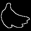 |  |

> 值越大 → 内部细节线越少（需要更强的边缘证据）

| ec=0.02 | ec=0.065（默认） | ec=0.15 | ec=0.30 |
|---------|---------------|---------|---------|
|  |  |  |  |

- 低值（0.02）：保留大量细节线，画面可能显得碎
- 高值（0.30）：只保留最强的边缘，画面更干净但可能丢失细节

### `edge_canny_support_radius`

Canny 线搜索半径。只有在轮廓或族边界此半径范围内的 Canny 线才会被采纳为内部细节：

| sr=0 | sr=1（默认） | sr=3 | sr=6 |
|------|-----------|------|------|
|  |  |  |  |

| sr=0 | sr=1（默认） | sr=3 | sr=6 |
|------|-----------|------|------|
|  |  |  |  |

- 0：完全关闭 Canny 细节（只有族边界作为内部线）
- 1–3：适中的细节保留
- 6+：几乎所有 Canny 线都被采纳，画面可能过于嘈杂

______________________________________________________________________

## 参数速查表

| 参数 | 默认值 | 影响 |
|------|--------|------|
| `alpha_coverage` | 0.16 | 前背景阈值。↑ 前景更瘦 |
| `edge_coverage` | 0.03 | Canny 边缘阈值。↑ 内部线更少 |
| `edge_min_length` | 2 | 内部细节线最短长度（像素） |
| `edge_canny_support_radius` | 6 | Canny 搜索半径。↑ 更多线被采纳 |
| `edge_open_before_thin` | false | 细化前开运算（去毛刺） |
| `small_cleanup_threshold` | 64 | 小精灵清理触发尺寸。0=永不 |
| `small_detail_min_length` | 4 | 小尺寸下细节线最短长度 |
| `small_cleanup_passes` | 2 | 局部平滑迭代次数。↑ 更平滑 |
| `small_hole_close` | true | 小尺寸 alpha 闭孔 |
| `small_tier_smooth_majority` | 5 | 明度平滑最少票数。↑ 更保守 |
| `small_skip_canny_under` | 40 | 此尺寸以下完全跳过 Canny |
